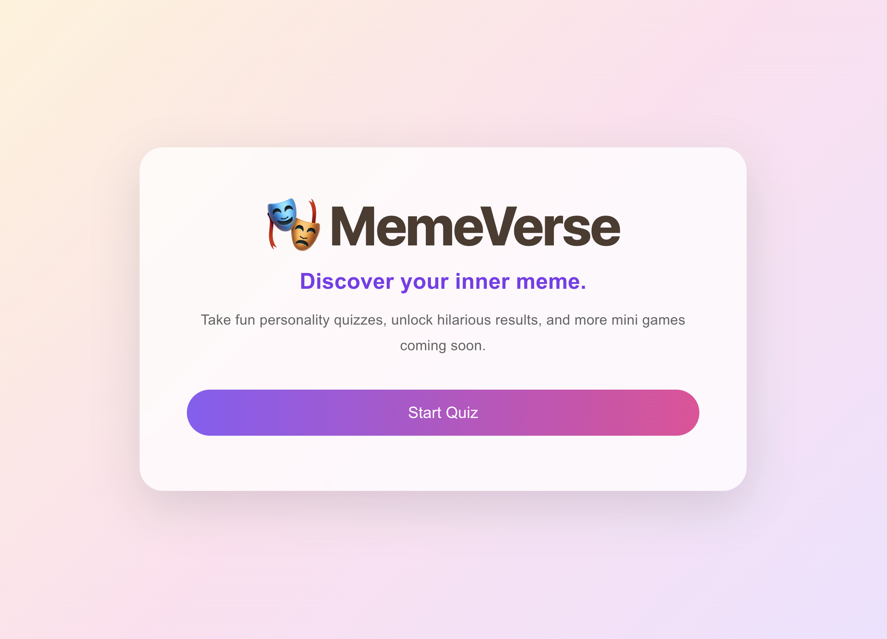
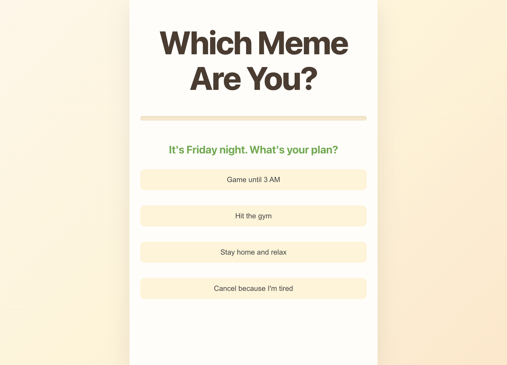
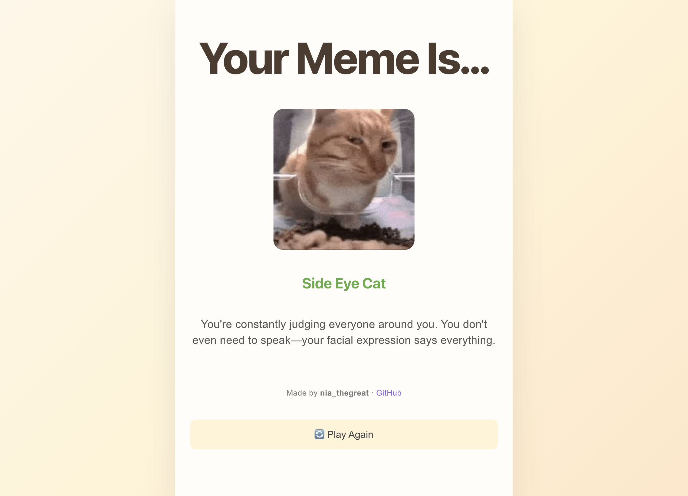

# MemeVerse

MemeVerse is a fun, interactive personality quiz that matches users with an internet meme based on their answers. Built as a full-stack web application, it combines a responsive React frontend with an Express.js backend to deliver a smooth and engaging quiz experience.

🌐 **Live Demo:** https://which-meme-are-you.vercel.app

---

## Features

- 📱 mobile-first design focus
- 🎮 Interactive personality quiz
- 📊 Progress bar with smooth transitions
- 🎨 Responsive design for desktop and mobile
- 🔄 Restart quiz functionality
- 📈 Google Analytics 4 event tracking
- ⚡ Fast Express API serving quiz data

---

## 🛠 Tech Stack

### Frontend
- React
- Vite
- CSS3

### Backend
- Node.js
- Express.js

### Deployment
- Vercel (Frontend)
- Render (Backend)

### Analytics
- Google Analytics 4 (GA4)

---

## 📸 Screenshots


### Landing Page



### Quiz



### Result



---

## 📂 Project Structure

```text
memeverse/
│
├── client/
│   ├── src/
│   ├── public/
│   └── index.html
│
├── server/
│   ├── data/
│   ├── routes/
│   └── server.js
│
└── README.md
```

---

## 🚀 Getting Started

### Clone the repository

```bash
git clone https://github.com/YOUR_USERNAME/memeverse.git
```

### Install dependencies

Frontend

```bash
cd client
npm install
```

Backend

```bash
cd ../server
npm install
```

### Start the backend

```bash
npm start
```

### Start the frontend

```bash
cd ../client
npm run dev
```

---

## 📈 Analytics

The application uses Google Analytics 4 to track user engagement.

Tracked events include:

- quiz_started
- quiz_completed
- meme_result_viewed

---

## 🎯 Future Improvements

- 🧠 More games
- 👤 User accounts
- 🏆 Leaderboards
- 🌍 Share results on social media

---

## Author

**Nia**

GitHub: https://github.com/nia_thegreat

---

## 📄 License

This project is licensed under the MIT License.